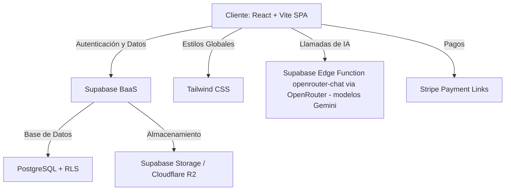
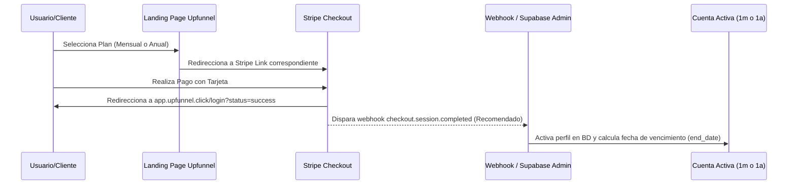

# 📘 Manual de Documentación Técnica - Upfunnel V3.0

> ⚠️ **Nota de vigencia (2026-07-04):** este manual es una referencia general **no autoritativa**. La documentación técnica autoritativa del proyecto vive en [`/docs`](./docs/README.md) (00-07) y, ante cualquier discrepancia, **el código real y `/docs` prevalecen**. La propiedad y cadencia de mantenimiento de este manual están pendientes de decidir (ver `docs/07_Pendientes_y_Riesgos.md`, pregunta 7).

Bienvenido al manual maestro de documentación de **Upfunnel**, un panel interactivo moderno y de alto rendimiento diseñado para centralizar, estructurar y ejecutar tareas de negocio utilizando una flota de 74 agentes especializados en Inteligencia Artificial.

Este documento ofrece una radiografía detallada de la arquitectura, estructura de archivos, base de datos, flujos de autenticación, gestión de suscripciones y directrices operativas del sistema.

---

## 🏗️ 1. Arquitectura de Alto Nivel

Upfunnel está diseñado como una **Single Page Application (SPA)** de alta velocidad bajo el paradigma de desarrollo moderno de frontend y Backend-as-a-Service (BaaS).



### Stack de Tecnologías
*   **Frontend**: React 18.2 (Virtual DOM optimizado, Hooks personalizados y Contextos).
*   **Herramienta de Construcción (Bundler)**: Vite 8.0 (HMR instantáneo y empaquetado optimizado).
*   **Estilos y UI**: Tailwind CSS v3 (Diseño responsivo, Grid espacial y personalización fluida) + CSS Puro en `src/App.css` para efectos avanzados (Glassmorphism, gradientes e iluminaciones de borde).
*   **Iconografía**: Lucide React (Consistente y vectorizado de peso pluma).
*   **BaaS (Backend)**: Supabase (PostgreSQL relacional, Autenticación integrada de nivel JWT y políticas de seguridad RLS).
*   **Pasarela de Pago**: Stripe (Enlaces de pago optimizados para alta conversión y cobro recurrente).

---

## 📂 2. Estructura de Directorios del Código Fuente

A continuación se detalla la jerarquía y propósito de cada sección de la aplicación dentro de la carpeta `/src`:

```
src/
├── app/                  # Configuraciones y layouts a nivel de aplicación
├── components/           # Componentes reutilizables e interactivos
├── components/admin/     # Componentes específicos del panel de administración
├── components/ui/        # Componentes atómicos de diseño (Toaster, botones, etc.)
├── components/user/      # Componentes de interacción del usuario normal
├── components/AgentCard.jsx # Tarjeta estándar de los agentes de IA
├── components/AgentCompactCard # Tarjeta optimizada para rejillas densas
├── components/AgentPanel.jsx # LA CONSOLA: Centro de chat interactivo con agentes
├── constants/            # Variables globales invariables de marca y sistema
├── constants/branding.js # Configuración central de logotipos, colores e identidad
├── context/              # Proveedores de contexto global de React
├── context/ToastContext.jsx # Desencadenante de alertas efímeras flotantes
├── data/                 # Archivos de datos maestros y estáticos
├── data/agents.js        # Base de datos local con los 74 agentes, especialidades y prompts
├── hooks/                # Hooks personalizados con lógica reutilizable
├── hooks/useAuth.jsx     # GESTOR DE SESIONES: Sincronización SWR con Supabase
├── hooks/useCloseModal.js # Utilidad de cierre interactivo por escape/clic externo
├── hooks/useFavorites.js # Almacenamiento de agentes marcados como favoritos
├── hooks/useReleaseNotes.js# Lógica de notificaciones de actualización
├── hooks/useTheme.jsx    # Gestor dinámico de brillo (Temas Claro y Oscuro)
├── lib/                  # Inicialización de clientes de servicios externos
├── lib/supabase.js       # Cliente unificado y singleton de Supabase
├── lib/academyR2Upload.js# Gestor de subidas de contenido para la Academia
├── pages/                # Páginas principales del enrutador de la aplicación
├── pages/admin/          # Páginas del panel de control de administradores
├── pages/ComingSoon.jsx  # Pantalla de mantenimiento o funciones futuras
├── pages/LandingPage.jsx # PÁGINA DE MARKETING: Interactiva y con animaciones Premium
├── pages/PendingApproval.jsx# Pantalla de bloqueo para usuarios sin suscripción activa
├── pages/Policies.jsx    # Página legal de términos de servicio
├── pages/Privacy.jsx     # Página legal de políticas de privacidad
├── pages/ReleaseHistory.jsx# Historial interactivo de lanzamientos y actualizaciones
├── pages/Support.jsx     # Centro de contacto y soporte prioritario
├── App.css               # Definición global de tokens de diseño y animaciones
├── App.jsx               # Enrutador centralizado (react-router-dom) y envoltorios
└── main.jsx              # Punto de entrada de renderizado en el DOM
```

---

## 🗄️ 3. Modelo de Datos y Base de Datos (Supabase)

La base de datos de Upfunnel reside en **Supabase** (PostgreSQL). Cuenta con Row Level Security (RLS) para proteger los datos contra accesos no autorizados.

### Tabla: `profiles`
Almacena la información de perfil, configuración y estado de membresía de cada usuario del sistema.
*   `id` (uuid, PK): Clave primaria vinculada a `auth.users.id`.
*   `email` (text): Dirección de correo única del usuario.
*   `name` (text): Nombre visible del usuario.
*   `avatar_url` (text): URL de la imagen de perfil (almacenada en Storage).
*   `role` (text): Rol del usuario (`user`, `support`, `editor`, `admin`, `core_admin`).
*   `status` (text): Estado operativo (`pending`, `active`, `inactive`, `rejected`, `expired`).
*   `is_approved` (boolean): Bandera de aprobación de acceso directo.
*   `plan` (text): Identificador de suscripción activa (`monthly` para plan mensual de $14.99 USD, `annual` para el anual de $79.99 USD, o `legacy` para acceso básico antiguo).
*   `is_legacy_fallback` (boolean): Si es `true`, al vencer su suscripción premium el sistema lo devuelve automáticamente al plan `legacy` con estado `active` en lugar de bloquear su cuenta.
*   `start_date` (timestamptz): Fecha en que se inició la suscripción activa.
*   `end_date` (timestamptz): Fecha exacta de vencimiento del acceso del usuario.
*   `timezone` (text): Zona horaria preferida (ej: `America/Mexico_City`).
*   `created_at` (timestamptz): Marca de tiempo del registro inicial.

### Tabla: `notifications`
Gestiona los avisos del sistema, alertas directas y mensajes globales emitidos por los administradores.
*   `id` (uuid, PK): Identificador único.
*   `user_id` (uuid, FK): Enlace al perfil de destino (si es nulo e `is_broadcast` es verdadero, es global).
*   `title` (text): Título de la notificación.
*   `message` (text): Mensaje descriptivo.
*   `type` (text): Nivel de alerta (`info`, `success`, `warning`, `error`).
*   `read` (boolean): Flag de lectura (aplica solo para notificaciones personales).
*   `is_broadcast` (boolean): Indica si la notificación se envía a toda la comunidad.
*   `origin` (text): Emisor de la alerta (ej: "Sistema", "Finanzas").

### Tabla: `audit_logs` (Historial de Actividad)
Conserva una bitácora detallada e inmutable de las operaciones sensibles ejecutadas en la plataforma.
*   `id` (bigint, PK): Auto-incremental.
*   `user_id` (uuid, FK): Usuario responsable de la acción.
*   `action` (text): Nombre del evento (ej: `CREATE_AGENT`, `BAN_USER`).
*   `entity` (text): Módulo afectado (ej: `profiles`, `agents`).
*   `entity_id` (text): Identificador del registro modificado.
*   `details` (jsonb): Objeto con datos del cambio (valores antiguos y nuevos).
*   `created_at` (timestamptz): Registro temporal del suceso.

---

## 🔐 4. Seguridad, Roles y Políticas RLS

Upfunnel aplica un estricto control de accesos basado en roles (**RBAC**):

*   **Usuario Estándar (`user`)**:
    *   Visualiza y filtra los 74 agentes de IA.
    *   Chatea con los agentes y hace solicitudes de recomendación a través del Copilot.
    *   Gestiona su propio perfil, foto, zona horaria y tema de visualización.
    *   *Bloqueo*: Si `status !== 'active'` o `end_date` es menor a la fecha de hoy, es redirigido automáticamente a la pantalla de aprobación pendiente (`/pending-approval`).
*   **Plan Acceso Básico Legacy (`legacy`)**:
    *   Mismo acceso básico al panel de agentes y visualización de cursos gratuitos en la Academia.
    *   *Bloqueado*: Se le bloquea por completo el Matchmaker Copilot y el acceso a los cursos marcados como Premium.
*   **Soporte (`support`)**:
    *   Mismas capacidades de usuario estándar.
    *   Acceso a leer sugerencias de usuarios y abrir tickets prioritarios.
*   **Editor (`editor`)**:
    *   Permisos adicionales para redactar notas de actualización (`Release Notes`) y configurar sugerencias de la academia.
*   **Administrador (`admin` / `core_admin`)**:
    *   Acceso irrestricto a la consola `/admin`.
    *   Capacidad de aprobar, desactivar, eliminar o cambiar roles y planes de usuarios.
    *   Control maestro del Copilot Matchmaker (API e instrucciones de comportamiento).
    *   Envío de banners y notificaciones de difusión global.
    *   *Regla de Oro*: El sistema prohíbe de forma dura y categórica degradar o eliminar al último administrador restante para evitar bloqueos del sistema.

---

## 💳 5. Flujo de Suscripción e Integración con Stripe

El acceso al panel se realiza bajo un modelo de suscripción premium, ofreciendo dos modalidades de pago:
1.  **Plan Mensual ($14.99 USD / mes)**: Acceso recurrente flexible sin contratos.
2.  **Plan Anual ($79.99 USD / año)**: Ahorro masivo del 60% con precio congelado de por vida.



### Lógica de Fechas en Activación
Al autorizar el acceso a un usuario desde el panel administrativo o webhook:
*   Si el usuario tiene asignado el **Plan Mensual**, su `end_date` se calcula sumando **1 mes** exacto a partir del momento de activación.
*   Si el usuario tiene asignado el **Plan Anual**, su `end_date` se calcula sumando **1 año** exacto.
*   Si el usuario es asignado al **Plan Legacy**, su `end_date` queda configurado como `null` ya que goza de acceso ilimitado a perpetuidad para funciones básicas.

---

## 🎨 6. Ecosistema UI/UX y Directrices de Diseño Premium

La interfaz de Upfunnel destaca por un estilo visual futurista de alta gama que combina:
*   **Glassmorphism**: Tarjetas con fondo translúcido (`bg-white/5` o `bg-black/20`), desenfoque profundo de fondo (`backdrop-blur-md`) y bordes sutiles semitransparentes (`border-white/10`).
*   **Neon Accents**: Uso estratégico del color turquesa neón (`#00e5ff`, `.text-neon-teal`) y morados vibrantes para las sombras luminosas y estados activos.
*   **Micro-animaciones**: Transiciones fluidas en hover de 300ms (`transition-all duration-300`) y efectos de escala discretos (`hover:scale-[1.02] active:scale-[0.98]`).
*   **Doble Tema Real**:
    *   *Light Mode*: Fondos blancos puros y limpios con bordes grises de bajo contraste que reducen la fatiga visual diurna.
    *   *Dark Mode*: Espacio profundo e inmersivo con una paleta base de azul marino espacial (`#080C14`).

---

## 🚀 7. Directrices Críticas para Despliegues Exitosos (Vercel)

El entorno de producción de Vercel opera bajo servidores basados en Linux, lo cual requiere estricto cuidado en los siguientes puntos para evitar fallos de compilación ("Página Negra"):

1.  **Respetar Mayúsculas y Minúsculas (Case-Sensitivity)**:
    *   Los archivos en Windows no distinguen de forma estricta las mayúsculas, pero Linux sí.
    *   *Importante*: Si un archivo se llama `SettingsModal.jsx`, debe importarse exactamente como:
        `import SettingsModal from './components/user/SettingsModal';`
        Importarlo como `settingsmodal` causará un error fatal en el pipeline de despliegue de Vercel.
2.  **Omitir Extensiones Internas**:
    *   Para evitar discrepancias en la importación de archivos de componentes de React, es recomendable omitir la extensión `.jsx` al importarlos dentro del código de JS.
3.  **Prevención de Errores Silenciosos (Try-Catch)**:
    *   Cualquier petición externa o consulta a la base de datos de Supabase debe ir envuelta en un bloque `try/catch`.
    *   En caso de desconexión o fallo, el sistema nunca debe mostrar un error de consola puro al usuario; en su lugar, se inyectan textos elegantes e interactivos para reintentar la acción.
