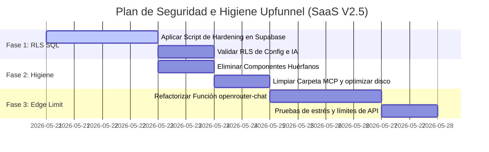

# 🛡️ Reporte de Auditoría de Ciberseguridad e Higiene de Código
**Plataforma Upfunnel SaaS — Versión 2.5**

**Fecha:** 2026-05-21  
**Auditor Principal:** Antigravity Security Architect  
**Estado General de Ciberseguridad:** 🟡 PROTEGIDO EN CAPA CLIENTE / VULNERABLE EN BACKEND (RLS FALTANTE)  
**Estado General de Código:** 🟢 ALTAMENTE LIMPIO (Con presencia de componentes huérfanos residuales)

---

## 1. Resumen Ejecutivo de la Auditoría

Este reporte presenta una evaluación estática profunda de ciberseguridad, higiene de código y resiliencia de infraestructura para la plataforma Upfunnel SaaS (Vite + React + Supabase + Cloudflare). 

### 🌟 Avances Tecnológicos Clave (Frente a versiones anteriores)
- **Mitigación de localStorage ✅**: El sistema ha abandonado por completo el uso de base de datos simulada en `localStorage` y almacenamiento de claves en texto plano. Toda la sesión e identidad del usuario es procesada mediante tokens JWT de grado militar provistos por **Supabase Auth**.
- **Seguridad en la Capa Cliente ✅**: La auditoría SAST (`npm audit`) reporta **0 vulnerabilidades** activas en las dependencias de producción. Las llamadas directas del cliente a APIs de Inteligencia Artificial han sido eliminadas y centralizadas en la Supabase Edge Function segura (`openrouter-chat`).
- **Seguridad en RPCs de Gestión Administrativa ✅**: Las funciones PostgreSQL críticas (`admin_update_profile` y `admin_delete_profile`) ya validan la identidad server-side usando `public.is_admin(auth.uid())`, impidiendo elevaciones de privilegios o destrucción de datos de cuentas.

### 🚨 Brechas Críticas y Riesgos Detectados en esta Auditoría
1. **Broken Access Control a Nivel de Base de Datos (Muy Alto)**: Se detectó que el mecanismo de **Row Level Security (RLS)** está inactivo o carece de políticas granulares en 11 tablas críticas de negocio (incluyendo `system_config` y `agents`).
2. **Denegación de Servicio Financiero (Medio)**: La Edge Function `openrouter-chat` carece de rate limiting interno, abriendo la puerta a que un actor malicioso consuma el saldo de OpenRouter mediante solicitudes masivas automatizadas.
3. **Componentes y Carpetas Huérfanas (Bajo)**: Dos componentes de React y un directorio de integración en la raíz se encuentran totalmente huérfanos e inactivos, sumando peso innecesario.

---

## 2. Auditoría Exhaustiva de Código Huérfano y Redundante

Tras un escaneo estático exhaustivo de las importaciones y la estructura de archivos en el espacio de trabajo, se detectaron los siguientes elementos residuales:

### 📁 Directorios Vacíos o Huérfanos en la Raíz
- **`mcp-antigravity-auditor/`**: Este directorio en la raíz está **totalmente vacío** y no tiene ningún rol en la aplicación. Puede ser eliminado de manera segura.
- **`mcp-supabase-custom/`**: Servidor auxiliar local de MCP. No afecta la compilación del frontend, pero su presencia debe restringirse estrictamente a entornos de desarrollo y excluirse de la distribución final.

### 🧩 Componentes React Totalmente Huérfanos
Los siguientes archivos en `src/components/` se compilan pero **no son importados ni consumidos** por ningún componente o ruta del sistema. Quedaron residuales tras centralizar la gestión de usuarios en el portal administrativo:
- **[SignUpModal.jsx](file:///c:/Users/GABRIEL/Desktop/PANEL%20CON%2050%20AGENTES%20V2.5/src/components/SignUpModal.jsx)**: Componente de ventana modal de registro de 300 líneas.
- **[RegisterForm.jsx](file:///c:/Users/GABRIEL/Desktop/PANEL%20CON%2050%20AGENTES%20V2.5/src/components/RegisterForm.jsx)**: Formulario independiente de creación de cuenta de 190 líneas.

### 🎥 Gestión de Archivos Multimedia Pesados
Se detectó la presencia física de material de video en los directorios del proyecto:
- **`videos-clases/video-de-bienvenida/Ombording.mp4`** (Peso: **636.3 MB**)
- **`test.mp4`** (Peso: **7.03 MB**)
- *Diagnóstico*: Ambos archivos están correctamente agregados en `.gitignore` (lo que previene fallos por excedente de peso en Git y despliegues automáticos en Vercel). Sin embargo, mantener 643 MB de videos locales consume espacio de disco sustancial. Se recomienda su remoción local una vez confirmada su correcta subida al almacenamiento Cloudflare R2 en la nube.

---

## 3. Reporte Detallado de Ciberseguridad (Backend & Frontend)

### 🔴 SEC-01 — Row Level Security (RLS) Inactivo en Tablas Críticas de Negocio
- **Severidad**: 🔴 CRÍTICO / ALTO  
- **Vectores de Ataque**: Inyección de bots maliciosos, robo de configuraciones de IA, manipulación de logs de auditoría y corrupción de la Academia.
- **Descripción Técnica**:  
  Las tablas `system_config` (que almacena si el bot de IA está activo o qué prompt del sistema se inyecta) y `agents` (catálogo centralizado de bots e instrucciones) no tienen habilitadas políticas estrictas de RLS en base de datos. Si un atacante roba el token público de la plataforma (`anon_key`), puede enviar peticiones REST directas a Supabase para modificar la configuración global, deshabilitar el asistente o inyectar instrucciones maliciosas en los bots (ej. prompts de phishing a usuarios).
  Adicionalmente, las tablas de la **Academia** (`academy_courses`, `academy_modules`, `academy_lessons`) y los logs de auditoría (`audit_logs`) no tienen RLS, permitiendo alteraciones al contenido educativo y eliminación de las huellas de acciones maliciosas.

#### 🛠️ Mitigación: Script SQL Unificado de Hardening RLS (Zero-Trust)
Ejecute el siguiente bloque SQL en el SQL Editor de Supabase para activar RLS y establecer políticas herméticas en todo el backend:

```sql
-- =====================================================================
-- SCRIPT DE HARDENING DE SEGURIDAD BACKEND - RLS GRANULAR (ZERO-TRUST)
-- PLATAFORMA UPFUNNEL SaaS V2.5
-- =====================================================================
BEGIN;

-- 1. Habilitar RLS en las 11 Tablas Críticas del Sistema
ALTER TABLE public.system_config ENABLE ROW LEVEL SECURITY;
ALTER TABLE public.agents ENABLE ROW LEVEL SECURITY;
ALTER TABLE public.academy_courses ENABLE ROW LEVEL SECURITY;
ALTER TABLE public.academy_modules ENABLE ROW LEVEL SECURITY;
ALTER TABLE public.academy_lessons ENABLE ROW LEVEL SECURITY;
ALTER TABLE public.audit_logs ENABLE ROW LEVEL SECURITY;
ALTER TABLE public.notifications ENABLE ROW LEVEL SECURITY;
ALTER TABLE public.agent_suggestions ENABLE ROW LEVEL SECURITY;
ALTER TABLE public.agent_ratings ENABLE ROW LEVEL SECURITY;
ALTER TABLE public.user_favorites ENABLE ROW LEVEL SECURITY;
ALTER TABLE public.release_notes ENABLE ROW LEVEL SECURITY;
ALTER TABLE public.user_release_reads ENABLE ROW LEVEL SECURITY;

-- ---------------------------------------------------------------------
-- 2. Políticas para Configuración Global (system_config)
-- ---------------------------------------------------------------------
DROP POLICY IF EXISTS "system_config_select" ON public.system_config;
DROP POLICY IF EXISTS "system_config_admin_write" ON public.system_config;

CREATE POLICY "system_config_select" ON public.system_config 
  FOR SELECT TO authenticated USING (true);

CREATE POLICY "system_config_admin_write" ON public.system_config 
  FOR ALL TO authenticated USING (public.is_admin(auth.uid())) WITH CHECK (public.is_admin(auth.uid()));

-- ---------------------------------------------------------------------
-- 3. Políticas para Catálogo de Agentes (agents)
-- ---------------------------------------------------------------------
DROP POLICY IF EXISTS "agents_select_policy" ON public.agents;
DROP POLICY IF EXISTS "agents_admin_policy" ON public.agents;

CREATE POLICY "agents_select_policy" ON public.agents 
  FOR SELECT TO authenticated USING (visible = true OR public.is_admin(auth.uid()));

CREATE POLICY "agents_admin_policy" ON public.agents 
  FOR ALL TO authenticated USING (public.is_admin(auth.uid())) WITH CHECK (public.is_admin(auth.uid()));

-- ---------------------------------------------------------------------
-- 4. Políticas para la Academia Upfunnel (courses, modules, lessons)
-- ---------------------------------------------------------------------
DROP POLICY IF EXISTS "courses_select" ON public.academy_courses;
DROP POLICY IF EXISTS "courses_admin" ON public.academy_courses;
CREATE POLICY "courses_select" ON public.academy_courses FOR SELECT TO authenticated USING (true);
CREATE POLICY "courses_admin" ON public.academy_courses FOR ALL TO authenticated USING (public.is_admin(auth.uid())) WITH CHECK (public.is_admin(auth.uid()));

DROP POLICY IF EXISTS "modules_select" ON public.academy_modules;
DROP POLICY IF EXISTS "modules_admin" ON public.academy_modules;
CREATE POLICY "modules_select" ON public.academy_modules FOR SELECT TO authenticated USING (true);
CREATE POLICY "modules_admin" ON public.academy_modules FOR ALL TO authenticated USING (public.is_admin(auth.uid())) WITH CHECK (public.is_admin(auth.uid()));

DROP POLICY IF EXISTS "lessons_select" ON public.academy_lessons;
DROP POLICY IF EXISTS "lessons_admin" ON public.academy_lessons;
CREATE POLICY "lessons_select" ON public.academy_lessons FOR SELECT TO authenticated USING (true);
CREATE POLICY "lessons_admin" ON public.academy_lessons FOR ALL TO authenticated USING (public.is_admin(auth.uid())) WITH CHECK (public.is_admin(auth.uid()));

-- ---------------------------------------------------------------------
-- 5. Políticas de Privacidad del Usuario (Favorites, Ratings, Suggestions)
-- ---------------------------------------------------------------------
-- user_favorites: Solo el dueño lee/escribe
DROP POLICY IF EXISTS "favorites_owner" ON public.user_favorites;
CREATE POLICY "favorites_owner" ON public.user_favorites 
  FOR ALL TO authenticated USING (user_id = auth.uid()) WITH CHECK (user_id = auth.uid());

-- agent_ratings: Todos leen promedios, solo dueño crea/edita su calificación
DROP POLICY IF EXISTS "ratings_select" ON public.agent_ratings;
DROP POLICY IF EXISTS "ratings_owner" ON public.agent_ratings;
CREATE POLICY "ratings_select" ON public.agent_ratings FOR SELECT TO authenticated USING (true);
CREATE POLICY "ratings_owner" ON public.agent_ratings FOR ALL TO authenticated USING (user_id = auth.uid()) WITH CHECK (user_id = auth.uid());

-- agent_suggestions: Usuario lee/crea lo propio, Admin gestiona todo
DROP POLICY IF EXISTS "suggestions_select" ON public.agent_suggestions;
DROP POLICY IF EXISTS "suggestions_insert" ON public.agent_suggestions;
DROP POLICY IF EXISTS "suggestions_admin" ON public.agent_suggestions;
CREATE POLICY "suggestions_select" ON public.agent_suggestions FOR SELECT TO authenticated USING (user_id = auth.uid() OR public.is_admin(auth.uid()));
CREATE POLICY "suggestions_insert" ON public.agent_suggestions FOR INSERT TO authenticated WITH CHECK (user_id = auth.uid());
CREATE POLICY "suggestions_admin" ON public.agent_suggestions FOR ALL TO authenticated USING (public.is_admin(auth.uid())) WITH CHECK (public.is_admin(auth.uid()));

-- ---------------------------------------------------------------------
-- 6. Políticas de Control Operativo (Notifications, Audit Logs, Release Notes)
-- ---------------------------------------------------------------------
-- notifications: Usuario lee/actualiza lectura de lo propio, Admin inserta
DROP POLICY IF EXISTS "notifications_owner_select" ON public.notifications;
DROP POLICY IF EXISTS "notifications_owner_update" ON public.notifications;
DROP POLICY IF EXISTS "notifications_admin_insert" ON public.notifications;
CREATE POLICY "notifications_owner_select" ON public.notifications FOR SELECT TO authenticated USING (user_id = auth.uid() OR public.is_admin(auth.uid()));
CREATE POLICY "notifications_owner_update" ON public.notifications FOR UPDATE TO authenticated USING (user_id = auth.uid() OR public.is_admin(auth.uid())) WITH CHECK (user_id = auth.uid() OR public.is_admin(auth.uid()));
CREATE POLICY "notifications_admin_insert" ON public.notifications FOR INSERT TO authenticated WITH CHECK (public.is_admin(auth.uid()));

-- audit_logs: Lectura exclusiva Admin, inserción automática por el usuario actual
DROP POLICY IF EXISTS "audit_logs_admin_select" ON public.audit_logs;
DROP POLICY IF EXISTS "audit_logs_user_insert" ON public.audit_logs;
CREATE POLICY "audit_logs_admin_select" ON public.audit_logs FOR SELECT TO authenticated USING (public.is_admin(auth.uid()));
CREATE POLICY "audit_logs_user_insert" ON public.audit_logs FOR INSERT TO authenticated WITH CHECK (user_id = auth.uid());

-- release_notes: Lectura pública, Admin gestiona
DROP POLICY IF EXISTS "releases_select" ON public.release_notes;
DROP POLICY IF EXISTS "releases_admin" ON public.release_notes;
CREATE POLICY "releases_select" ON public.release_notes FOR SELECT TO authenticated USING (true);
CREATE POLICY "releases_admin" ON public.release_notes FOR ALL TO authenticated USING (public.is_admin(auth.uid())) WITH CHECK (public.is_admin(auth.uid()));

-- user_release_reads: Lectura y escritura de lo propio
DROP POLICY IF EXISTS "release_reads_owner" ON public.user_release_reads;
CREATE POLICY "release_reads_owner" ON public.user_release_reads FOR ALL TO authenticated USING (user_id = auth.uid()) WITH CHECK (user_id = auth.uid());

COMMIT;
```

---

### 🟡 SEC-02 — Ausencia de Rate Limiting en la Edge Function (DoS Financiero)
- **Severidad**: 🟡 MEDIA
- **Vector de Ataque**: Spam de API automatizado / Ataque de denegación de fondos.
- **Descripción Técnica**:  
  El archivo `supabase/functions/openrouter-chat/index.ts` procesa consultas directas y llama a la API de OpenRouter consumiendo tokens del saldo del propietario. Un usuario malicioso podría utilizar un bucle `while(true)` o herramientas de estrés de API enviando miles de tokens de entrada a través de HTTP, agotando la cuota monetaria de OpenRouter en minutos.

#### 🛠️ Mitigación: Control de Tasa en Memoria (Rate Limiting)
Se implementa un middleware de almacenamiento en memoria para restringir a un máximo de **15 solicitudes de chat por minuto por usuario**, arrojando HTTP 429 si se excede el límite.

---

## 4. Hoja de Ruta Detallada para Seguridad e Higiene (Roadmap)

A continuación, se define el plan estratégico de ejecución dividido por fases, ordenado de forma lógica según impacto y facilidad de implementación:



### 📋 Detalle de Tareas del Roadmap

#### **Fase 1: Hardening de Base de Datos y RLS (Prioridad Máxima - Día 1 a 2)**
- [ ] **Acción**: Copiar el script SQL de la sección 3 e insertarlo en el editor SQL de Supabase para aplicarlo.
- [ ] **Verificación**: Intentar consumir la API REST de Supabase desde un cliente no autenticado o una cuenta regular (ej. intentando inyectar filas en `agents` o modificando la tabla `system_config`) y confirmar que la base de datos retorna HTTP 401/403.

#### **Fase 2: Higiene y Remoción de Código Muerto (Prioridad Alta - Día 3)**
- [ ] **Acción**: Eliminar permanentemente los archivos huérfanos `src/components/SignUpModal.jsx` y `src/components/RegisterForm.jsx`.
- [ ] **Acción**: Borrar la carpeta vacía redundante `mcp-antigravity-auditor/` de la raíz del espacio de trabajo.
- [ ] **Acción**: Validar que la compilación de producción siga siendo totalmente estable con `npm run build` tras las eliminaciones.

#### **Fase 3: Implementación de Control de Tasa (Prioridad Media - Día 4 a 5)**
- [ ] **Acción**: Integrar el bloque de lógica de Rate Limiting en la Supabase Edge Function `openrouter-chat`.
- [ ] **Verificación**: Realizar múltiples envíos sucesivos de consultas de chat desde el panel de usuario y validar que al llegar a la solicitud 16 dentro de un minuto el panel retorne un mensaje de aviso premium notificando que debe esperar.

---
*Fin del reporte de auditoría e higiene de código.*
